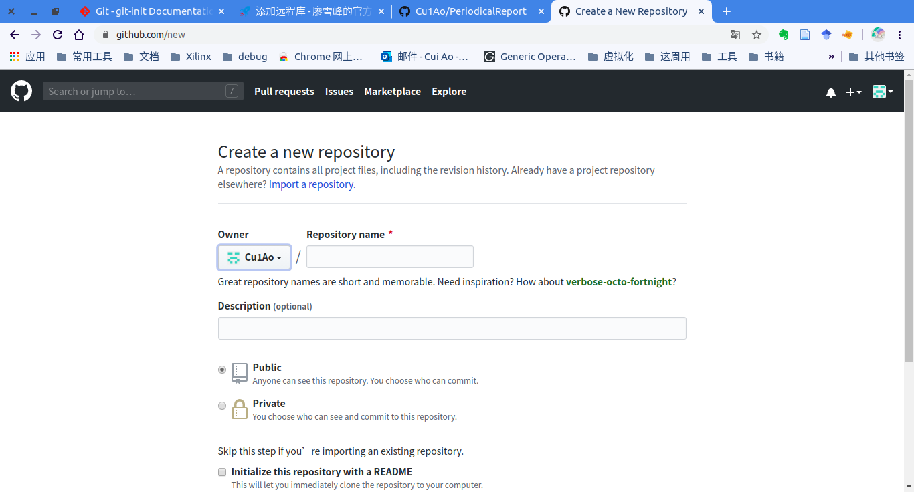

# git乃必备神技

git作为目前最为常见的版本控制工具，应该是每一个程序员所掌握的。但是一直没有系统地学习过git的相关知识，所以在这里按照自己平时使用git的场景，记录下所有常见的git命令。　

[toc]

## １　创建一个本地版本库
> 参考：[廖雪峰的官方网站－Git教程](https://www.liaoxuefeng.com/wiki/896043488029600/896827951938304)
### 1.1 创建一个版本库
什么是版本库呢？版本库又名仓库，英文名repository，你可以简单理解成一个目录，这个目录里面的所有文件都可以被Git管理起来，每个文件的修改、删除，Git都能跟踪，以便任何时刻都可以追踪历史，或者在将来某个时刻可以“还原”。

所以，创建一个版本库非常简单，首先，选择一个合适的地方，创建一个空目录：
```
(base) ☁  (/home/ao/Desktop)  mkdir NoteBook 
(base) ☁  (/home/ao/Desktop)  cd NoteBook 
(base) ☁  (/home/ao/Desktop/NoteBook)  pwd
/home/ao/Desktop/NoteBook
```
第二步，通过git init命令把这个目录变成Git可以管理的仓库：
```
(base) ☁  (/home/ao/Desktop/NoteBook)  git init 
已初始化空的 Git 仓库于 /home/ao/Desktop/NoteBook/.git/
(base) ☁  (/home/ao/Desktop/NoteBook) [master] ⚡  ls -a
.  ..  .git  Notebook  PeriodcalReport
```

记得编写一个`README.md`文件哦。

### 1.2 添加文件到版本库 

和把大象放到冰箱需要3步相比，把一个文件放到Git仓库只需要**两步**。

* 第一步，用命令git add告诉Git，把文件添加到仓库：
```
$ git add readme.txt
执行上面的命令，没有任何显示，这就对了，Unix的哲学是“没有消息就是好消息”，说明添加成功。
```
* 第二步，用命令git commit告诉Git，把文件提交到仓库：
```
$ git commit -m "wrote a readme file"
[master (root-commit) eaadf4e] wrote a readme file
 1 file changed, 2 insertions(+)
 create mode 100644 readme.txt
```
简单解释一下git commit命令，-m后面输入的是本次提交的说明，可以输入任意内容，当然最好是有意义的，这样你就能从历史记录里方便地找到改动记录。

嫌麻烦不想输入-m "xxx"行不行？确实有办法可以这么干，但是强烈不建议你这么干，因为输入说明对自己对别人阅读都很重要。实在不想输入说明的童鞋请自行Google，我不告诉你这个参数。

git commit命令执行成功后会告诉你，1 file changed：1个文件被改动（我们新添加的readme.txt文件）；2 insertions：插入了两行内容（readme.txt有两行内容）。

## 2 远程仓库
### 2.1 添加远程仓库
有了本地版本库之后，肯定会想继续把它提交到github上，实现版本的分布式管理。同样，这也只需要几步就可以实现。

* 第一步，在github网站上新建一个仓库，仓库的名字与本地库的名字保持一致：



* 第二部，将本地仓库与远程仓库关联：

```
(base) ☁  (/home/ao/Desktop/PeriodicalReport) [master] ⚡  git remote add origin git@github.com:Cu1Ao/PeriodicalReport.git
```
之后的推送可以省略前两步。

* 第三步，将本地仓库所有的内容推送到远程仓库：

```
(base) ☁  (/home/ao/Desktop/PeriodicalReport) [master] git push -u origin master 
枚举对象: 19, 完成.
对象计数中: 100% (19/19), 完成.
使用 4 个线程进行压缩
压缩对象中: 100% (19/19), 完成.
写入对象中: 100% (19/19), 992.60 KiB | 2.20 MiB/s, 完成.
总共 19 （差异 2），复用 0 （差异 0）
remote: Resolving deltas: 100% (2/2), done.
To github.com:Cu1Ao/PeriodicalReport.git
 * [new branch]      master -> master
```

第一次推送的时候加上`-u`选项，Git不但会把本地的master分支内容推送的远程新的master分支，还会把本地的master分支和远程的master分支关联起来，在以后的推送或者拉取时就可以简化命令。

## 删除仓库里的文件

删除操作相应也很简单，在本地仓库用`rm`命令删除本地文件后，再使用

```
git rm -rf dir
```
命令即可删除`commit`中文件。

使用
```
git checkout --
```
可以恢复至最新版本。