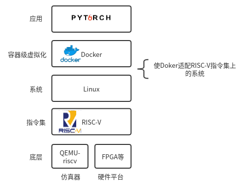
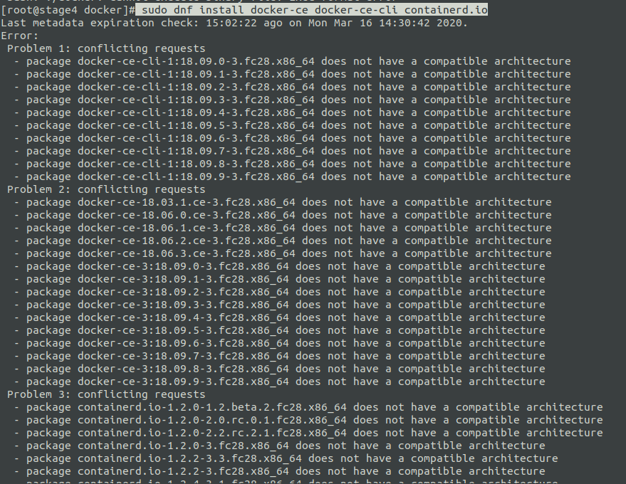
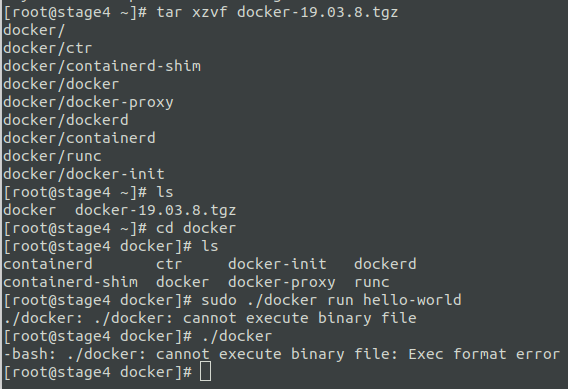
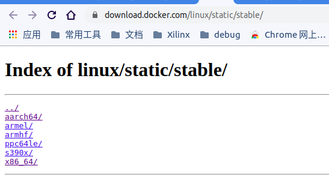
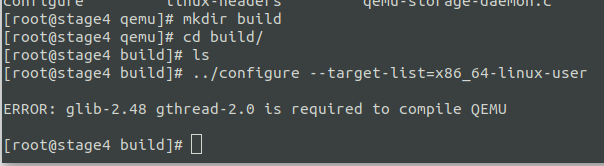

# Report 0319
## 工作进度
为了在`riscv`架构下的linux中实现虚拟化，我们之前的系统架构如下：

上周之前我遇到的问题主要有：
* 使用的Linux镜像功能不完整，缺少安装`Docker`的相关依赖，无法联网，无法与宿主机通信，不方便调试等；
 导致工作前进。

这两周我编译了新的linux系统镜像， 解决了大部分问题，现在已经有了一个较好的调试环境：
 * 可以访问网络，支持`git`等，可以直接下载软件包进行安装；
 * 可以通过`ssh`和宿主机通信；

但是我在安装`Docker`的过程中，由于系统的底层架构问题，出现如下情形：
> 安装过程参考[官方文档](https://docs.docker.com/install/linux/docker-ce/fedora/)
* 2、直接从网络下载源码安装

报错信息说明**does not have a compatible architecture**
* 2、直接安装静态二进制文件
　  
执行依然出错，因为官方给出的二进制文件中，并没有适配`riscv`架构：

所以目前来说，直接在`riscv`架构上安装`Docker`是不可行的，所以我想尝试了另外两种方法：
* １、在`riscv`架构的linux系统中模拟目标硬件
  通过运行一个全功能模拟器，我们可以启动一个可以运行 Linux 操作系统的通用 `arm/x86_64`等架构的虚拟机，然后在虚拟机中设置开发环境，编译应用程序。整个模拟系统同样可以使用`QEMU`实现。
* ２、通过`QEMU`模拟目标架构的用户空间
  在 Linux 系统上，`QEMU` 有另外一种操作模式，可以通过用户模式模拟器来运行非本地架构的二进制程序。该模式下，`QEMU` 会跳过方法 １ 中描述的对整个目标系统硬件的模拟，取而代之的是通过 `binfmt_misc` 在 Linux 内核注册一个二进制格式处理程序，将陌生二进制代码拦截并转换后再执行，同时将系统调用按需从目标系统转换成当前系统。最终对于用户来说，实现在本机运行这些异构二进制程序。其他架构的二进制程序可以在`Docker`提供的页面中找到。

### 目前的进展
方法１的思路更加简单直接，我先尝试了按照方法１来做，在虚拟机中安装`QEMU`，build一个`x86_64`架构：

出现的问题是，缺少两个依赖文件：`glib-2.48`, `gthread-2.0`

下周会努力尝试安装好这两个依赖文件，如果因为架构问题安装失败的话，会继续尝试方法２。
